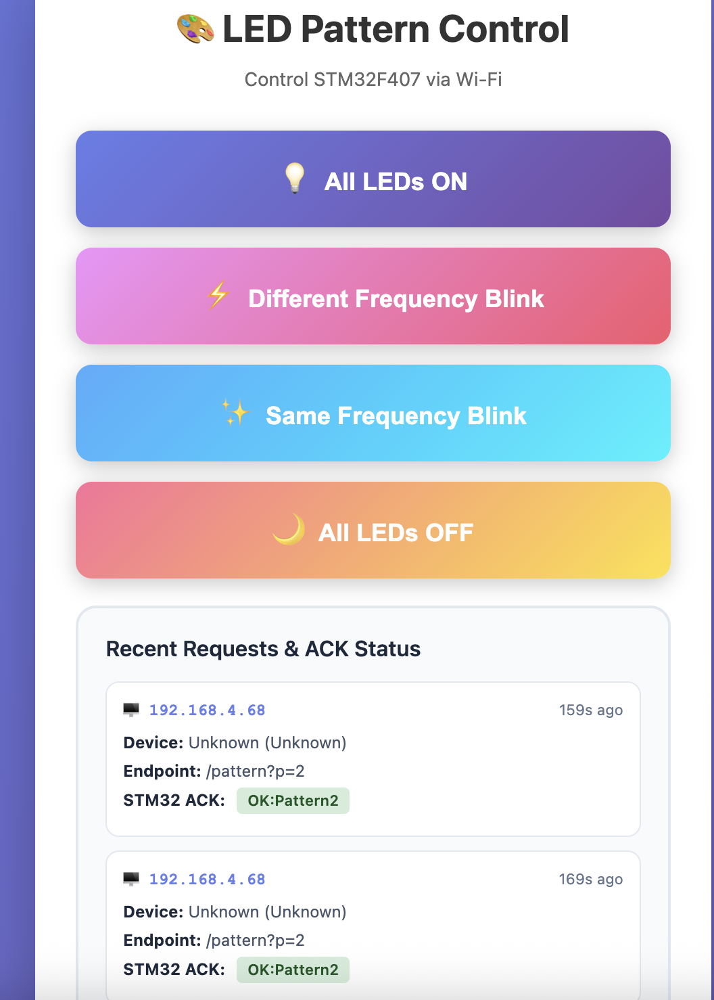

# ESP8266 Wi-Fi-to-UART Bridge


ESP8266 NodeMCU firmware implementing a Wi-Fi-to-UART bridge for wireless control of STM32F407 LED patterns. Features RESTful web API, responsive web interface, ACK status tracking, request history logging, and bidirectional PING/PONG connection monitoring with collision prevention.

---

## 🎯 Project Overview

This firmware turns the ESP8266 into a wireless bridge between web clients and an STM32F407 microcontroller. It demonstrates professional IoT bridge architecture with real-time status monitoring, robust UART communication, and user-friendly web interface.

### Key Features

**Web Server:**
- ✅ **HTTP Server** - Runs on port 80 with RESTful API endpoints
- ✅ **Responsive Web UI** - Mobile-friendly interface with auto-refresh (5s interval)
- ✅ **Pattern Control** - 4 LED patterns selectable via web buttons
- ✅ **Request History** - Circular buffer storing last 10 requests with metadata
- ✅ **ACK Status Display** - Real-time STM32 acknowledgment tracking on webpage
- ✅ **Device Detection** - Automatic identification of client device/browser

**UART Communication:**
- ✅ **SoftwareSerial** - Dedicated UART for STM32 communication (115200 baud)
- ✅ **Bidirectional PING/PONG** - Connection health monitoring with random jitter
- ✅ **Collision Prevention** - Random 0-2s jitter prevents synchronized pings
- ✅ **ACK Capture** - Waits for and logs STM32 acknowledgments
- ✅ **Buffer Management** - 128-byte RX buffer with overflow protection
- ✅ **Line-Based Parsing** - Handles newline-terminated messages

**Debugging & Monitoring:**
- ✅ **Serial Monitor Logging** - Comprehensive debug output (115200 baud)
- ✅ **UART Status Alerts** - Detects lost connection to STM32
- ✅ **Wi-Fi Reconnection** - Automatic recovery from network drops
- ✅ **Client IP Tracking** - Logs all HTTP requests with IP/User-Agent

---

## 📸 Web Interface


*Real-time LED control with request history and ACK status tracking*

**Features Shown:**
- System status (Wi-Fi, IP, uptime, signal strength)
- LED pattern control buttons (Pattern 1-4)
- Recent requests table with IP, device, endpoint, ACK status
- Auto-refresh every 5 seconds

---

## 🏗️ System Architecture

### High-Level Overview

```
┌─────────────────────────────────────────────────────────────────────────┐
│                         CLIENT DEVICES                                  │
│              (Laptop, Smartphone, Tablet, Desktop)                      │
│                    HTTP GET /pattern?p=<1-4>                           │
└────────────────────────────────┬────────────────────────────────────────┘
                                 │ Wi-Fi (2.4 GHz)
                                 ↓
┌─────────────────────────────────────────────────────────────────────────┐
│                      ESP8266 NodeMCU (This Firmware)                    │
│                                                                         │
│  ┌──────────────────────────────────────────────────────────────────┐  │
│  │                    HTTP Request Handler                          │  │
│  │   ┌────────────┐  ┌─────────────┐  ┌─────────────────────────┐  │  │
│  │   │   GET /    │  │GET /pattern │  │   GET /clients          │  │  │
│  │   │  Homepage  │  │  ?p=<1-4>   │  │   (JSON API)            │  │  │
│  │   └────────────┘  └─────────────┘  └─────────────────────────┘  │  │
│  └──────────────────────────────────────────────────────────────────┘  │
│                                 │                                       │
│                                 ↓                                       │
│  ┌──────────────────────────────────────────────────────────────────┐  │
│  │              Request Tracking Module                             │  │
│  │  • Extract Client IP (server.client().remoteIP())               │  │
│  │  • Parse User-Agent (server.header("User-Agent"))               │  │
│  │  • Detect Device Type (iPhone/Android/Mac/Windows)              │  │
│  │  • Store in Circular Buffer (10 entries with ACK status)        │  │
│  │  • Log to Serial Monitor with timestamps                        │  │
│  └──────────────────────────────────────────────────────────────────┘  │
│                                 │                                       │
│                                 ↓                                       │
│  ┌──────────────────────────────────────────────────────────────────┐  │
│  │                SoftwareSerial TX/RX Module                       │  │
│  │  • D1 (GPIO5) TX → STM32 UART2 RX                               │  │
│  │  • D2 (GPIO4) RX ← STM32 UART2 TX                               │  │
│  │  • Baud Rate: 115200                                            │  │
│  │  • Protocol: LED_CMD:X, PING/PONG, STM32_PING/STM32_PONG       │  │
│  │  • Random Jitter: 0-2000ms (prevents collisions)                │  │
│  └──────────────────────────────────────────────────────────────────┘  │
└────────────────────────────────┬────────────────────────────────────────┘
                                 │ UART (115200 baud)
                                 ↓
┌─────────────────────────────────────────────────────────────────────────┐
│                   STM32F407 Discovery (FreeRTOS)                        │
│  • Receives LED_CMD:X commands                                          │
│  • Responds with OK:PatternX acknowledgments                            │
│  • Sends STM32_PING, responds with PONG                                 │
│  • Controls 4 LED patterns via software timers                          │
└─────────────────────────────────────────────────────────────────────────┘
```

### Communication Protocol

**UART Messages (ESP8266 ↔ STM32):**

| Direction | Message | Purpose | Response |
|-----------|---------|---------|----------|
| ESP → STM | `LED_CMD:1\r\n` | Set Pattern 1 (All LEDs ON) | `OK:Pattern1\r\n` |
| ESP → STM | `LED_CMD:2\r\n` | Set Pattern 2 (Different Freq) | `OK:Pattern2\r\n` |
| ESP → STM | `LED_CMD:3\r\n` | Set Pattern 3 (Same Freq) | `OK:Pattern3\r\n` |
| ESP → STM | `LED_CMD:4\r\n` | Set Pattern 4 (All LEDs OFF) | `OK:AllOFF\r\n` |
| ESP → STM | `PING\r\n` | Connection test | `PONG\r\n` |
| STM → ESP | `STM32_PING\r\n` | Connection test | `STM32_PONG\r\n` |

**Timing:**
- ESP8266 PING frequency: 10s + (0-2s random jitter)
- STM32 PING frequency: 10s + (0-2s random jitter)
- PING timeout: 1000ms
- ACK wait timeout: 500ms

**Serial Monitor Output (Debug):**
- All Wi-Fi connection events
- All HTTP requests with client IP/device
- All UART messages (both directions)
- Connection status and alerts

---

## 🖥️ Serial Monitor Output

### Complete Boot & Initialization

```
========================================
  ESP8266 LED Control Web Server
  SoftwareSerial Mode
========================================
Serial Monitor: Debug messages
SoftwareSerial: STM32 commands
========================================

[WIFI] Starting Wi-Fi connection...
[WIFI] SSID: YourNetworkName
[WIFI] Connecting..........
[WIFI] ✓ Connected successfully!
[WIFI] --------------------------------
[WIFI] IP Address:  192.168.1.100
[WIFI] MAC Address: 5C:CF:7F:AB:CD:EF
[WIFI] Gateway:     192.168.1.1
[WIFI] Subnet Mask: 255.255.255.0
[WIFI] Signal:      -42 dBm
[WIFI] --------------------------------

[SERVER] Configuring web server...
[SERVER] Web server started on port 80
[SERVER] Access at: http://192.168.1.100
========================================
  System Ready!
========================================
```

### LED Command Request Flow (Pattern 1)

```
[HTTP] GET /pattern?p=1
[STM32] Sending LED command...
[STM32] → Sending: LED_CMD:1 [SENT]
[STM32] ← ACK: OK:Pattern1
[CLIENT] --------------------------------
[CLIENT] IP: 192.168.1.105
[CLIENT] Endpoint: /pattern?p=1
[CLIENT] Total Requests: 1
[CLIENT] --------------------------------
[HTTP] Response sent to browser
```

### LED Command Request Flow (Pattern 2)

```
[HTTP] GET /pattern?p=2
[STM32] Sending LED command...
[STM32] → Sending: LED_CMD:2 [SENT]
[STM32] ← ACK: OK:Pattern2
[CLIENT] --------------------------------
[CLIENT] IP: 192.168.1.105
[CLIENT] Endpoint: /pattern?p=2
[CLIENT] Total Requests: 2
[CLIENT] --------------------------------
[HTTP] Response sent to browser
```

### LED Command Request Flow (Pattern 3)

```
[HTTP] GET /pattern?p=3
[STM32] Sending LED command...
[STM32] → Sending: LED_CMD:3 [SENT]
[STM32] ← ACK: OK:Pattern3
[CLIENT] --------------------------------
[CLIENT] IP: 192.168.1.105
[CLIENT] Endpoint: /pattern?p=3
[CLIENT] Total Requests: 3
[CLIENT] --------------------------------
[HTTP] Response sent to browser
```

### LED Command Request Flow (All OFF)

```
[HTTP] GET /pattern?p=4
[STM32] Sending LED command...
[STM32] → Sending: LED_CMD:4 [SENT]
[STM32] ← ACK: OK:AllOFF
[CLIENT] --------------------------------
[CLIENT] IP: 192.168.1.105
[CLIENT] Endpoint: /pattern?p=4
[CLIENT] Total Requests: 4
[CLIENT] --------------------------------
[HTTP] Response sent to browser
```

### UART Connection Monitoring (ESP8266 → STM32)

```
[UART] --------------------------------
[UART] → Sending PING to STM32...
[UART] ← PONG received
[UART] ✓ Connection confirmed
[UART] --------------------------------
```

### UART Connection Monitoring (STM32 → ESP8266)

```
[UART] --------------------------------
[UART] ← STM32_PING received
[UART] → Sent STM32_PONG response
[UART] --------------------------------
```

### Connection Loss Detection

```
[UART] ✗ ALERT: No PONG from STM32!
[UART] UART connection may be broken
[UART] --------------------------------
```

### Wi-Fi Status Monitoring (Every 30 seconds)

```
[WIFI] Connected | IP: 192.168.1.100 | Signal: -45 dBm
[WIFI] Connected | IP: 192.168.1.100 | Signal: -47 dBm
[WIFI] Connected | IP: 192.168.1.100 | Signal: -43 dBm
```

### Multiple Client Requests (Different Devices)

```
[HTTP] GET /pattern?p=1
[STM32] Sending LED command...
[STM32] → Sending: LED_CMD:1 [SENT]
[STM32] ← ACK: OK:Pattern1
[CLIENT] --------------------------------
[CLIENT] IP: 192.168.1.105
[CLIENT] Endpoint: /pattern?p=1
[CLIENT] Total Requests: 5
[CLIENT] --------------------------------
[HTTP] Response sent to browser

[HTTP] GET /pattern?p=2
[STM32] Sending LED command...
[STM32] → Sending: LED_CMD:2 [SENT]
[STM32] ← ACK: OK:Pattern2
[CLIENT] --------------------------------
[CLIENT] IP: 192.168.1.110
[CLIENT] Endpoint: /pattern?p=2
[CLIENT] Total Requests: 6
[CLIENT] --------------------------------
[HTTP] Response sent to browser

[HTTP] GET /clients - Serving client history
```

---

## 🚀 Quick Start

### Prerequisites

**Hardware:**
- NodeMCU ESP8266 development board
- STM32F407 Discovery board (see [STM32 firmware README](../stm32-firmware/README.md))
- USB cable (Micro-USB for programming)
- Jumper wires (3x for UART connection)

**Software:**
- Arduino IDE (v1.8.x or v2.x)
- ESP8266 Board Package (v3.0.0+)

**Network:**
- 2.4 GHz Wi-Fi network (ESP8266 does NOT support 5 GHz)

### Installation

#### 1. Install ESP8266 Board Support

```
Arduino IDE → Preferences → Additional Boards Manager URLs
Add: http://arduino.esp8266.com/stable/package_esp8266com_index.json

Tools → Board → Boards Manager → Search "esp8266" → Install
```

#### 2. Configure Wi-Fi Credentials

Edit `ESP8266_LED_WebServer.ino` (lines 73-74):

```cpp
const char* WIFI_SSID = "YOUR_WIFI_SSID";     // Replace with your Wi-Fi name
const char* WIFI_PASSWORD = "YOUR_PASSWORD";  // Replace with your Wi-Fi password
```

#### 3. Upload Firmware

```
Arduino IDE Settings:
- Board: "NodeMCU 1.0 (ESP-12E Module)"
- Upload Speed: 115200
- CPU Frequency: 80 MHz
- Flash Size: "4M (1M SPIFFS)"
- Port: /dev/cu.usbserial-* (Mac) or COM* (Windows)

Click Upload (→)
```

#### 4. Connect Hardware

**ESP8266 ↔ STM32 Wiring:**

```
ESP8266 NodeMCU          STM32F407 Discovery
─────────────────        ────────────────────
D1 (GPIO5) TX     ───>   PA3 (USART2 RX)
D2 (GPIO4) RX     <───   PA2 (USART2 TX)
GND               ───>   GND
```

⚠️ **CRITICAL:** Both boards use 3.3V logic - safe to connect directly

#### 5. Access Web Interface

1. Open Serial Monitor (115200 baud)
2. Note the IP address: `[WIFI] IP Address: 192.168.x.x`
3. Open browser: `http://192.168.x.x/`
4. Click LED pattern buttons
5. Watch ACK status update in real-time

---

## 🔌 API Documentation

### Endpoints

#### `GET /`
**Description:** Serve main HTML interface
**Response:** `text/html` (embedded in PROGMEM)

**Example:**
```bash
curl http://192.168.1.100/
```

---

#### `GET /pattern?p={1|2|3|4}`
**Description:** Send LED pattern command to STM32
**Parameters:**
- `p` (required): Pattern number (1, 2, 3, or 4)

**Response:** `text/plain`
```
Pattern 2 sent to STM32
```

**Pattern Descriptions:**
| Pattern | Description | STM32 Response |
|---------|-------------|----------------|
| 1 | All LEDs ON (solid) | `OK:Pattern1` |
| 2 | Different frequency blink | `OK:Pattern2` |
| 3 | Same frequency blink | `OK:Pattern3` |
| 4 | All LEDs OFF | `OK:AllOFF` |

**Example:**
```bash
curl http://192.168.1.100/pattern?p=2
# Response: Pattern 2 sent to STM32
```

**Error Responses:**
- `400 Bad Request` - Missing parameter: `ERROR: Missing 'p' parameter`
- `400 Bad Request` - Invalid pattern: `ERROR: Invalid pattern (must be 1-4)`

---

#### `GET /clients`
**Description:** Get client request history with ACK status
**Response:** `application/json`

```json
{
  "totalRequests": 42,
  "recentRequests": [
    {
      "ip": "192.168.1.105",
      "endpoint": "/pattern?p=2",
      "userAgent": "Mozilla/5.0 (iPhone; CPU iPhone OS 16_0 like Mac OS X) AppleWebKit/605.1.15 (KHTML, like Gecko) Version/16.0 Mobile/15E148 Safari/604.1",
      "ack": "OK:Pattern2",
      "uptime": "15s ago"
    },
    {
      "ip": "192.168.1.110",
      "endpoint": "/pattern?p=1",
      "userAgent": "Mozilla/5.0 (Macintosh; Intel Mac OS X 10_15_7) AppleWebKit/537.36 (KHTML, like Gecko) Chrome/120.0.0.0 Safari/537.36",
      "ack": "OK:Pattern1",
      "uptime": "42s ago"
    }
  ]
}
```

**Example:**
```bash
curl http://192.168.1.100/clients | jq
```

---

## 💡 Technical Implementation

### Request Tracking Module

The ESP8266 logs all HTTP requests to a circular buffer with STM32 ACK status:

```cpp
struct RequestLog {
  String ip;                 // Client IP from TCP connection
  String endpoint;           // Requested endpoint (/pattern?p=X)
  unsigned long timestamp;   // Request timestamp (millis)
  String userAgent;          // User-Agent header for device detection
  String ack;                // Last ACK received from STM32 (OK:PatternX)
};

RequestLog recentRequests[10];  // Circular buffer (10 slots)
```

**Key Implementation Details:**
1. IP extracted via `server.client().remoteIP()`
2. User-Agent parsed from HTTP headers
3. ACK captured by waiting up to 500ms after sending command
4. Newest entries displayed first in web interface

### UART Communication Flow

```cpp
void sendCommandToSTM32(String pattern) {
  // 1. Clear previous ACK
  lastAckReceived = "";

  // 2. Send command via SoftwareSerial
  stm32Serial.print("LED_CMD:");
  stm32Serial.println(pattern);

  // 3. Wait for ACK (max 500ms)
  unsigned long start = millis();
  while (lastAckReceived.length() == 0 && (millis() - start < 500)) {
    processSTM32Response();  // Check for incoming ACK
    delay(10);
  }

  // 4. ACK now available in lastAckReceived
}
```

### Collision Prevention Strategy

Both ESP8266 and STM32 send periodic PINGs. Without jitter, they could collide on the UART:

**Problem:**
```
Time 0s:  ESP8266 → PING  }  Both transmit simultaneously
Time 0s:  STM32   → PING  }  → Collision, garbled data
```

**Solution: Random Jitter**
```cpp
// 10 seconds + random 0-2000ms jitter
unsigned long nextPingJitter = random(0, 2000);
unsigned long interval = 10000 + nextPingJitter;

if (millis() - lastPing >= interval) {
  stm32Serial.println("PING");
  nextPingJitter = random(0, 2000);  // New jitter for next ping
}
```

This creates a **uniform distribution** over [10s, 12s], significantly reducing collision probability.

### Memory Management

**HTML Storage:**
```cpp
const char INDEX_HTML[] PROGMEM = R"rawliteral(
<!DOCTYPE html>
...
)rawliteral";
```
- Stored in flash memory (PROGMEM) instead of RAM
- Saves ~3KB of precious ESP8266 RAM

**Circular Buffer:**
```cpp
#define MAX_REQUESTS 10
RequestLog recentRequests[MAX_REQUESTS];
```
- Fixed-size array prevents memory overflow
- Oldest entries automatically overwritten

**String Optimization:**
- Dynamic strings only for temporary processing
- HTTP response strings freed after transmission
- Buffer overflow protection (max 128 bytes)

### Performance Characteristics

| Metric | Value |
|--------|-------|
| HTTP Response Time | < 50ms |
| UART Command Latency | < 10ms |
| ACK Capture Timeout | 500ms |
| Auto-refresh Interval | 5 seconds |
| PING Interval | 10-12s (with jitter) |
| Maximum Simultaneous Clients | ~5 (ESP8266 limitation) |
| Request History Size | 10 entries |
| Free Heap (typical) | ~43KB |

---

## 📁 File Structure

```
esp8266-firmware/
├── ESP8266_LED_WebServer.ino    # Main Arduino sketch
│   ├── Configuration Section     # Wi-Fi credentials, pins, timing
│   ├── setup()                   # Wi-Fi and web server initialization
│   ├── loop()                    # HTTP client handling, UART monitoring
│   ├── setupWiFi()               # Wi-Fi connection with status logging
│   ├── setupWebServer()          # Register HTTP endpoints
│   ├── handleRoot()              # Serve HTML page
│   ├── handlePattern()           # Process LED commands
│   ├── handleClients()           # Serve JSON request history
│   ├── sendCommandToSTM32()      # UART TX with ACK capture
│   ├── logRequest()              # Store request in circular buffer
│   ├── checkUARTConnection()     # PING/PONG monitoring
│   └── processSTM32Response()    # UART RX parser
├── index.h                       # HTML/CSS/JavaScript web interface
│   ├── HTML Structure            # Responsive layout
│   ├── CSS Styling               # Mobile-friendly design
│   └── JavaScript                # Auto-refresh, AJAX calls
└── README.md                     # This file
```

---

## 🔧 Hardware Setup

### Pin Configuration

**ESP8266 NodeMCU GPIO Mapping:**

```
D1 (GPIO5)  ──► SoftwareSerial TX ──► STM32 PA3 (USART2 RX)
D2 (GPIO4)  ──► SoftwareSerial RX ──► STM32 PA2 (USART2 TX)
GND         ──► Common Ground    ──► STM32 GND

USB Port    ──► Micro-USB (Power + Programming + Serial Monitor)
```

### Wiring Diagram

```
┌─────────────────────────┐         ┌─────────────────────────┐
│   ESP8266 NodeMCU       │         │   STM32F407 Discovery   │
│                         │         │                         │
│  D1 (GPIO5) TX ─────────┼────────>│ PA3 (USART2 RX)        │
│  D2 (GPIO4) RX <────────┼─────────│ PA2 (USART2 TX)        │
│  GND ───────────────────┼─────────│ GND                    │
│                         │         │                         │
│  [ Micro-USB ]          │         │  [ USB ST-Link ]       │
└──────┬──────────────────┘         └────────┬───────────────┘
       │                                     │
       │ USB Data Cable                      │ USB Data Cable
       │                                     │
       ▼                                     ▼
┌─────────────┐                       ┌─────────────┐
│  Computer   │                       │  Computer   │
│             │                       │             │
│ Serial Mon  │                       │ STM32CubeIDE│
│ (Debug)     │                       │ (Flash/Debug)│
└─────────────┘                       └─────────────┘
```

**Important Notes:**
- ✅ Both use 3.3V logic - safe to connect directly
- ✅ Cross TX/RX: ESP TX → STM RX, ESP RX → STM TX
- ✅ Common ground is critical for reliable UART
- ⚠️ Do NOT connect 5V - both boards are 3.3V

---

## 🐛 Troubleshooting

### Wi-Fi Connection Failed

**Symptoms:**
```
[WIFI] ✗ Connection Failed!
```

**Solutions:**
1. ✅ Verify Wi-Fi credentials in code (lines 73-74)
2. ✅ Ensure 2.4 GHz network (ESP8266 does NOT support 5 GHz)
3. ✅ Check router allows new device connections
4. ✅ Move ESP8266 closer to router (RSSI should be > -70 dBm)
5. ✅ Restart router if necessary
6. ✅ Try different Wi-Fi network

---

### Upload Failed

**Symptoms:**
```
espcomm_open failed
espcomm_upload_mem failed
```

**Solutions:**
1. ✅ Install CH340/CP2102 USB drivers (Windows/Mac)
2. ✅ Close Serial Monitor before uploading
3. ✅ Try different USB cable (must support data transfer)
4. ✅ Select correct port: Tools → Port → /dev/cu.usbserial-* or COM*
5. ✅ Press FLASH button during upload (if needed)
6. ✅ Reduce upload speed: Tools → Upload Speed → 57600

---

### Web Interface Not Accessible

**Symptoms:** Browser shows "Can't reach this page"

**Solutions:**
1. ✅ Verify IP address in Serial Monitor: `[WIFI] IP Address: 192.168.x.x`
2. ✅ Ensure computer/phone on same Wi-Fi network as ESP8266
3. ✅ Disable firewall temporarily
4. ✅ Try `ping 192.168.x.x` from terminal
5. ✅ Use `http://` not `https://` (no SSL)
6. ✅ Check router's connected devices list
7. ✅ Try accessing from different device

---

### No ACK from STM32

**Symptoms:**
```
[STM32] Warning: No ACK received
```

**Solutions:**
1. ✅ Verify UART wiring (TX → RX crossed, GND connected)
2. ✅ Check STM32 firmware is running (see [STM32 README](../stm32-firmware/README.md))
3. ✅ Confirm both boards at 115200 baud
4. ✅ Check STM32 UART3 debug logs for received commands
5. ✅ Verify both boards powered on
6. ✅ Test with jumper wire loopback (D1 → D2) to verify SoftwareSerial working

---

### UART Connection Alerts

**Symptoms:**
```
[UART] ✗ ALERT: No PONG from STM32!
[UART] UART connection may be broken
```

**Solutions:**
1. ✅ Check TX/RX wiring (should be crossed)
2. ✅ Verify GND connected between boards
3. ✅ Ensure STM32 firmware running (LED blink test)
4. ✅ Check for loose connections
5. ✅ Monitor STM32 UART3 for PING messages
6. ✅ Verify both boards at 115200 baud

---

### Client Tracking Shows "Unknown"

**Expected Behavior:** Some clients may not send User-Agent headers. The system will still track IP address and endpoints correctly.

---

## 🎓 Learning Outcomes

This firmware demonstrates:

**ESP8266 Development:**
- Wi-Fi connectivity and station mode configuration
- HTTP web server implementation (ESP8266WebServer library)
- SoftwareSerial for UART communication
- PROGMEM usage for flash storage optimization

**Communication Protocols:**
- RESTful API design with JSON responses
- UART protocol implementation (line-based parsing)
- Bidirectional health monitoring (PING/PONG)
- Collision prevention with random jitter

**Web Development:**
- Responsive HTML/CSS for embedded systems
- AJAX for real-time updates without page reload
- Client metadata extraction (IP, User-Agent)
- Device detection from User-Agent strings

**System Design:**
- Bridge architecture (Wi-Fi ↔ UART)
- Request tracking with circular buffers
- ACK capture and status display
- Error handling and timeout management

**Debugging Strategies:**
- Dual serial ports (USB for debug, SoftwareSerial for communication)
- Comprehensive logging with categorized messages
- Connection monitoring and alerts
- Real-time status visibility

---

## 🔜 Future Enhancements

- [ ] WebSocket support for instant updates (eliminate 5s polling)
- [ ] mDNS support (access via `http://led-controller.local`)
- [ ] OTA (Over-The-Air) firmware updates
- [ ] HTTPS/TLS encryption with self-signed certificate
- [ ] Authentication (password protection for web interface)
- [ ] MQTT integration for cloud connectivity
- [ ] Data logging to SPIFFS/LittleFS
- [ ] STM32 firmware version detection
- [ ] Retry logic for failed commands
- [ ] Hardware flow control (RTS/CTS)

---

## 📚 References

- [ESP8266 Arduino Core Documentation](https://arduino-esp8266.readthedocs.io/)
- [ESP8266WebServer Library](https://github.com/esp8266/Arduino/tree/master/libraries/ESP8266WebServer)
- [SoftwareSerial Library](https://github.com/plerup/espsoftwareserial)
- [NodeMCU Documentation](https://nodemcu.readthedocs.io/)
- [ESP8266 Community Forum](https://www.esp8266.com/)

---

## 📝 License

This project is licensed under the MIT License - see [LICENSE](../LICENSE) for details.
